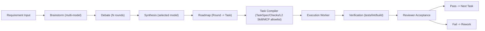

# Architecture

## End-to-End Flow

## Relationship Table

| Stage | Owner Role | Inputs | Outputs | MCP/Tooling |
|---|---|---|---|---|
| Brainstorm | Brainstormers (multi-model) | Requirement | candidate proposals | `model-router` |
| Debate | Brainstormers | proposals | critiques per round | `model-router` |
| Synthesis | Planner model | proposals + critiques | architecture decision + roadmap | `model-router` |
| Task Compile | Brain/Orchestrator | roadmap node | `TaskSpec.md`, `Checks.md`, `TASK.SKILL.md`, `mcp_allowlist.json` | `scripts/brain.ts` |
| Execution | Worker model | task package | code changes + explanation | `claude-runner` or provider API |
| Verification | CI/local | code changes | pass/fail evidence | test/lint/build commands |
| Acceptance | Reviewer model | diff + evidence | accept/reject + risks | provider API / MCP |

## Skill Layers

- L0: roadmap scheduler only
- L1: domain reusable playbooks
- L2: short task instance skill generated per task

## Permission Model

- Default: minimum required MCP tool allowlist per task
- Optional: dangerous permission switches by model (`codex/claude/gemini`)
- Full automation mode: dangerous switches all enabled

