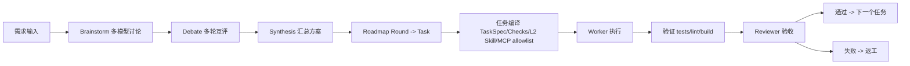

# 架构说明

English version: [ARCHITECTURE.en.md](ARCHITECTURE.en.md)

## 端到端流程图

## 关系表

| 阶段 | 负责角色 | 输入 | 输出 | MCP/工具 |
|---|---|---|---|---|
| Brainstorm | 多模型讨论组 | Requirement | 候选方案 | `model-router` |
| Debate | 多模型讨论组 | 候选方案 | 互评结果（按轮次） | `model-router` |
| Synthesis | 指定汇总模型 | 方案 + 互评 | 统一决策 + Roadmap | `model-router` |
| Task Compile | Brain/Orchestrator | Roadmap 节点 | `TaskSpec.md` `Checks.md` `TASK.SKILL.md` `mcp_allowlist.json` | `scripts/brain.ts` |
| Execution | Worker 模型 | 任务包 | 代码改动 + 执行说明 | `claude-runner` 或 provider API |
| Verification | CI/本地 | 代码改动 | 通过/失败证据 | test/lint/build |
| Acceptance | Reviewer 模型 | diff + 验证证据 | accept/reject + 风险列表 | provider API / MCP |

## Skill 分层

- L0：只做 roadmap 调度和验收门禁
- L1：稳定的领域技能（可复用）
- L2：任务实例技能（短、小、按任务生成）

## 权限模型

- 默认：每个 Task 使用最小 MCP allowlist
- 可选：按模型开启危险权限（codex / claude / gemini）
- 全程自动化：危险权限统一开启（仅建议在可信环境）
